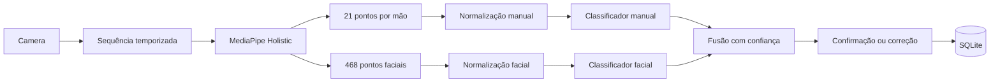

# Reconhecimento Integrado de Libras Design

**Spec**: `.specs/features/reconhecimento-integrado-libras/spec.md`
**Status**: Approved by implementation request

## Architecture Overview

## Code Reuse Analysis

| Component | Location | How to Use |
| --- | --- | --- |
| Captura manual existente | `main.py` | Referência para MediaPipe e câmera |
| Sessões e eventos | `database/communication.py` | Ampliar evento com resultado facial |
| API local | `webapp/server.py` | Receber frames e devolver previsão integrada |
| Interface | `webapp/static/` | Exibir as duas modalidades e manter correção |

## Components

### Dataset contract

- **Purpose**: Validar amostras e metadados sincronizados.
- **Location**: `recognition/dataset.py`
- **Interface**: `SampleMetadata.validate()` e `save_sample()`.

### Feature processor

- **Purpose**: Normalizar mãos e face, suavizar e padronizar o tempo.
- **Location**: `recognition/features.py`
- **Interface**: `manual_features()` e `facial_features()`.

### Training pipeline

- **Purpose**: Dividir por participante, treinar SVM e produzir relatório.
- **Location**: `training/train.py`
- **Dependencies**: NumPy, scikit-learn e joblib.

### Integrated recognizer

- **Purpose**: Extrair landmarks, executar os modelos e fundir resultados.
- **Location**: `recognition/runtime.py` e `recognition/fusion.py`.
- **Dependencies**: OpenCV, MediaPipe, NumPy e artefatos treinados.

### Web adapter

- **Purpose**: Receber sequência de JPEGs e expor resultado conferível.
- **Location**: `webapp/application.py`, `webapp/server.py`, `webapp/static/app.js`.

## Data Models

`IntegratedPrediction` contém estado, rótulo manual, expressão facial, confianças, versões e mensagem operacional. `SampleMetadata` contém participante, rótulos, iluminação, resolução, FPS, duração e consentimento de gravação.

## Error Handling Strategy

| Error Scenario | Handling | User Impact |
| --- | --- | --- |
| Dependência ou modelo ausente | `model_unavailable` | Inserção manual continua ativa |
| Uma modalidade ausente | `partial` | Resultado disponível é mostrado |
| Nenhuma detecção | `no_detection` | Solicitação para reposicionar-se |
| Imagem inválida ou excessiva | HTTP 400 | Mensagem de validação |

## Risks & Concerns

| Concern | Location | Impact | Mitigation |
| --- | --- | --- | --- |
| Python 3.14 sem MediaPipe | `.venv` | Inferência não inicia | Ambiente separado Python 3.11 e imports opcionais |
| Ausência de dataset | projeto | Sem acurácia real | Coletor e treino reproduzível, sem alegação de qualidade |
| Persistência ponto a ponto | `database/db.py` | Coleta lenta | Novo coletor salva amostras em lote |
| Front captura somente imagem | `webapp/static/app.js` | Sinais dinâmicos não funcionam | Captura sequencial temporizada |
| Módulo facial vazio | `camera/face_tracking.py` | Trabalho de Pedro ausente | Substituir por pipeline Holistic integrado |

## Tech Decisions

| Decision | Choice | Rationale |
| --- | --- | --- |
| Detector | MediaPipe Holistic 0.10.21 | Sincroniza mãos e 468 landmarks faciais no mesmo frame |
| Baseline | SVM probabilístico | Adequado a dataset inicial e fornece confiança |
| Split | Grupo por participante | Evita vazamento da mesma pessoa entre treino e teste |
| Artefato | joblib + JSON de metadados | Simples, local e versionável fora do Git |
| Frames | 30 por sequência | Concreto e compatível com análise temporal inicial |
